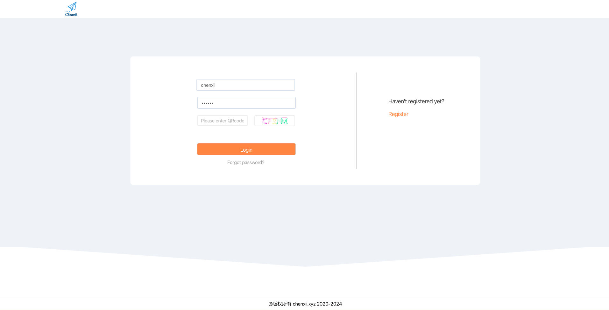
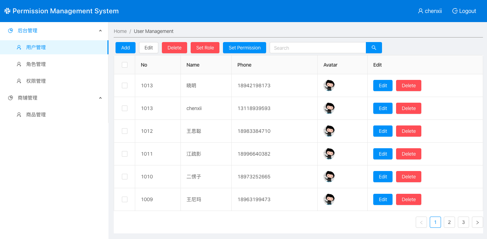
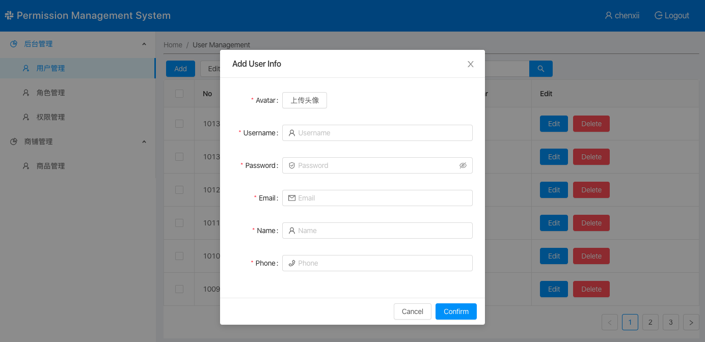
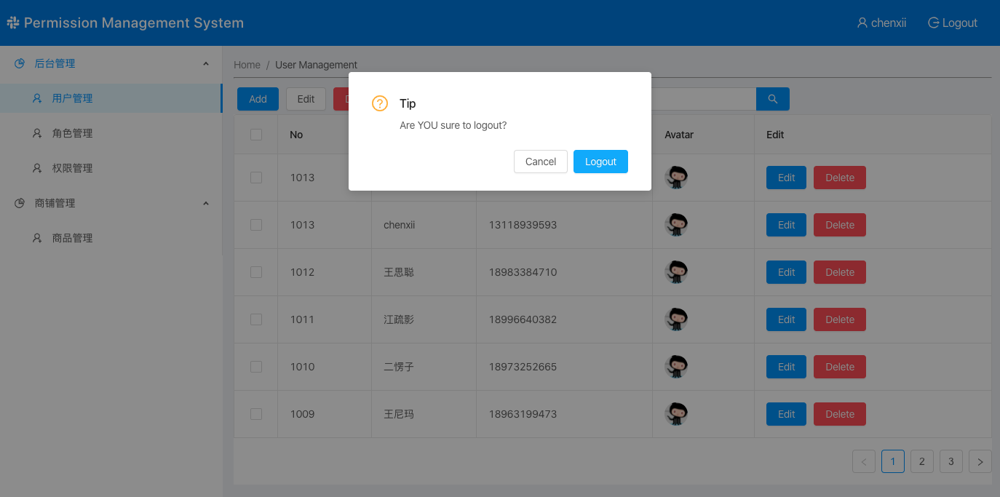
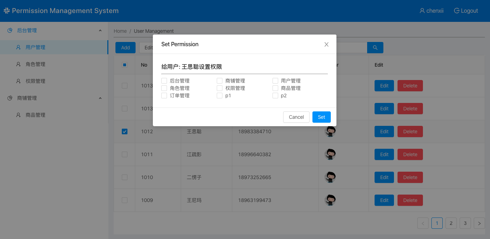
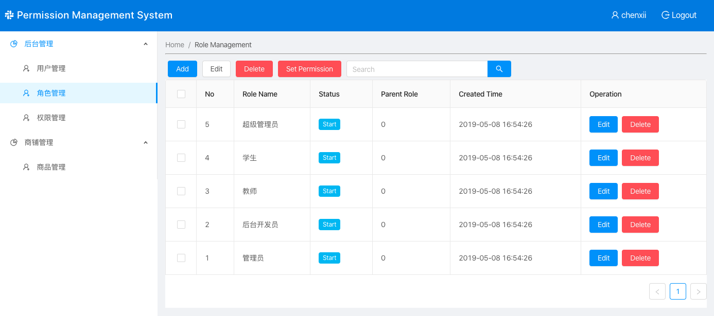
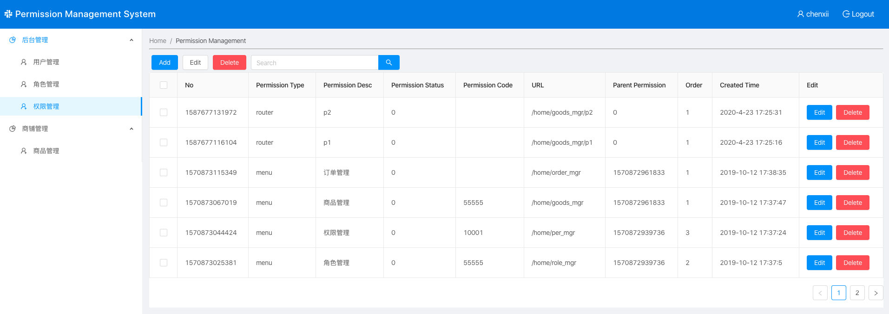

## React Permissions Management System

> 一个基于 React 全家桶制作的管理系统项目

#### Preview | 预览















---

### 技术栈

- react
- redux
- axios
- scss
- react-redux
- redux-thunk
- ant design ui
- react-router-dom

---

### 本地运行

```
git clone https://github.com/ChenxiiCheng/React-Permissions.git
cd React-Permissions
npm install  // Or use yarn
npm run start // Or yarn start
```
